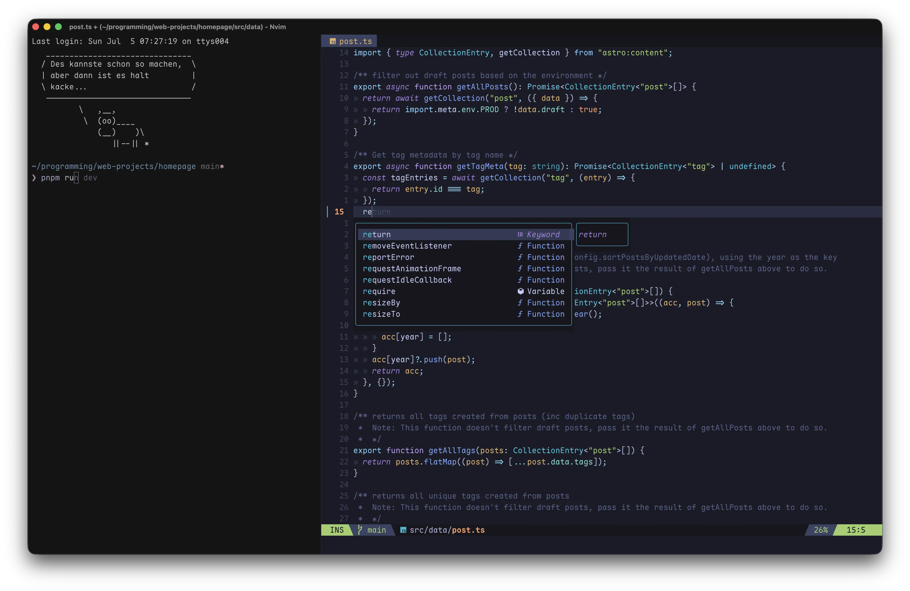
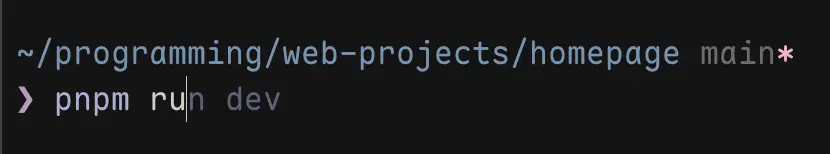
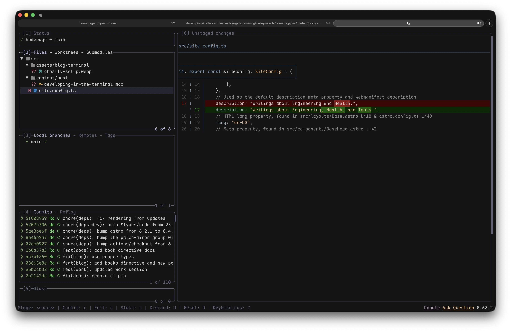

My terminal has been my home for several years now.

I have fallen in love with the customizability, speed, and lack of context
switching. All I need to do I can do from **one place**. And so, I've had no
desire to visit my old friend Electron ever since.

Getting to this point took a lot of research and experimenting. I read through
hundreds of `zsh` and `nvim` setups others had shared online to pick out the
few gems. Then, I would trial them in my own config, deleting the things that
didn't stick. A courteous open-source warrior would release a new, faster tool,
forcing me to throw out my previous work and start anew.

Now, I've come to a point where I feel comfortable sharing my config with
others.

## The Goal

At this point you might wonder why go through all this effort.

My ultimate goal is to reduce the effort it takes to get things done on my
computer. This is a problem of navigation and context switching disguised as
one of avoiding the UI.

If you spend a lot of time using a computer, you probably learned touch-typing
at some point because the interruption of looking at the keyboard for every
keystroke became too much of a burden. The natural extension of this is
removing mouse usage.

> Navigation, getting where you want as fast as possible to do your task, is
> the 2nd most important part of using your computer after typing.
>
> -- Me on a wise day

A part of me dies inside whenever I see someone with 10 small, slightly
off-center windows reach for the mouse to select the one that is hopefully
their application. A friend of mine started using a window manager, `cmd-tab`,
and `cmd-t` at work and is now getting paid extra to teach "modern computer
usage" at their medical practice[^1].

[^1]: I wish I was making this up.

<style>{`
  @keyframes cursor-bob {
    0%, 100% { transform: translate(0, 0) rotate(-8deg); }
    50% { transform: translate(3px, -4px) rotate(-8deg); }
  }
  .cursor-bob { animation: cursor-bob 2.4s ease-in-out infinite; }
  @keyframes q-pulse {
    0%, 100% { opacity: 1; transform: scale(1); }
    50% { opacity: .55; transform: scale(.9); }
  }
  .q-pulse { animation: q-pulse 1.6s ease-in-out infinite; }
`}</style>

<div class="bg-rose-500/5 dark:bg-rose-500/10 border border-rose-500/30 rounded-xl p-3 sm:p-5">
  <div class="flex flex-wrap items-baseline gap-x-3 gap-y-2 mb-2">
    <span class="text-[12px] font-mono uppercase tracking-widest text-rose-700 dark:text-rose-300">✗ · The Mouse Hunt</span>
  </div>
  <p class="text-[14px] text-gray-600 dark:text-gray-300 mb-4">My personal nightmare. Scattered windows navigated by mouse clicks.</p>

{/* the pile */}

  <div class="relative h-60 overflow-hidden rounded-lg border border-dashed border-rose-500/20 bg-rose-500/[0.03]">

    {/* window template: header dots + indistinguishable gray content */}
    {/* 1 */}
    <div class="absolute left-[2%] top-10 w-40 sm:w-44 rounded-lg border border-gray-200 dark:border-gray-700 bg-white dark:bg-gray-800 shadow-lg p-2 -rotate-6 z-10">
      <div class="flex gap-1 mb-2"><span class="w-1.5 h-1.5 rounded-full bg-gray-300 dark:bg-gray-600"></span><span class="w-1.5 h-1.5 rounded-full bg-gray-300 dark:bg-gray-600"></span><span class="w-1.5 h-1.5 rounded-full bg-gray-300 dark:bg-gray-600"></span></div>
      <div class="h-1.5 rounded bg-gray-200 dark:bg-gray-700 w-11/12 mb-1"></div>
      <div class="h-1.5 rounded bg-gray-200 dark:bg-gray-700 w-2/3"></div>
    </div>
    {/* 2 */}
    <div class="absolute left-[22%] top-6 w-40 sm:w-44 rounded-lg border border-gray-200 dark:border-gray-700 bg-white dark:bg-gray-800 shadow-lg p-2 rotate-3 z-20">
      <div class="flex gap-1 mb-2"><span class="w-1.5 h-1.5 rounded-full bg-gray-300 dark:bg-gray-600"></span><span class="w-1.5 h-1.5 rounded-full bg-gray-300 dark:bg-gray-600"></span><span class="w-1.5 h-1.5 rounded-full bg-gray-300 dark:bg-gray-600"></span></div>
      <div class="h-1.5 rounded bg-gray-200 dark:bg-gray-700 w-10/12 mb-1"></div>
      <div class="h-1.5 rounded bg-gray-200 dark:bg-gray-700 w-3/4"></div>
    </div>
    {/* 3 */}
    <div class="absolute left-[43%] top-12 w-40 sm:w-44 rounded-lg border border-gray-200 dark:border-gray-700 bg-white dark:bg-gray-800 shadow-lg p-2 -rotate-3 z-30">
      <div class="flex gap-1 mb-2"><span class="w-1.5 h-1.5 rounded-full bg-gray-300 dark:bg-gray-600"></span><span class="w-1.5 h-1.5 rounded-full bg-gray-300 dark:bg-gray-600"></span><span class="w-1.5 h-1.5 rounded-full bg-gray-300 dark:bg-gray-600"></span></div>
      <div class="h-1.5 rounded bg-gray-200 dark:bg-gray-700 w-11/12 mb-1"></div>
      <div class="h-1.5 rounded bg-gray-200 dark:bg-gray-700 w-2/3"></div>
    </div>
    {/* 4 */}
    <div class="absolute left-[62%] top-6 w-40 sm:w-44 rounded-lg border border-gray-200 dark:border-gray-700 bg-white dark:bg-gray-800 shadow-lg p-2 rotate-6 z-10">
      <div class="flex gap-1 mb-2"><span class="w-1.5 h-1.5 rounded-full bg-gray-300 dark:bg-gray-600"></span><span class="w-1.5 h-1.5 rounded-full bg-gray-300 dark:bg-gray-600"></span><span class="w-1.5 h-1.5 rounded-full bg-gray-300 dark:bg-gray-600"></span></div>
      <div class="h-1.5 rounded bg-gray-200 dark:bg-gray-700 w-10/12 mb-1"></div>
      <div class="h-1.5 rounded bg-gray-200 dark:bg-gray-700 w-3/5"></div>
    </div>
    {/* 5 */}
    <div class="absolute left-[10%] top-24 w-40 sm:w-44 rounded-lg border border-gray-200 dark:border-gray-700 bg-white dark:bg-gray-800 shadow-lg p-2 rotate-2 z-20">
      <div class="flex gap-1 mb-2"><span class="w-1.5 h-1.5 rounded-full bg-gray-300 dark:bg-gray-600"></span><span class="w-1.5 h-1.5 rounded-full bg-gray-300 dark:bg-gray-600"></span><span class="w-1.5 h-1.5 rounded-full bg-gray-300 dark:bg-gray-600"></span></div>
      <div class="h-1.5 rounded bg-gray-200 dark:bg-gray-700 w-11/12 mb-1"></div>
      <div class="h-1.5 rounded bg-gray-200 dark:bg-gray-700 w-2/3"></div>
    </div>
    {/* 6 */}
    <div class="absolute left-[58%] top-20 w-40 sm:w-44 rounded-lg border border-gray-200 dark:border-gray-700 bg-white dark:bg-gray-800 shadow-lg p-2 -rotate-5 z-10">
      <div class="flex gap-1 mb-2"><span class="w-1.5 h-1.5 rounded-full bg-gray-300 dark:bg-gray-600"></span><span class="w-1.5 h-1.5 rounded-full bg-gray-300 dark:bg-gray-600"></span><span class="w-1.5 h-1.5 rounded-full bg-gray-300 dark:bg-gray-600"></span></div>
      <div class="h-1.5 rounded bg-gray-200 dark:bg-gray-700 w-10/12 mb-1"></div>
      <div class="h-1.5 rounded bg-gray-200 dark:bg-gray-700 w-3/4"></div>
    </div>
    {/* 7 */}
    <div class="absolute left-[68%] top-36 w-40 sm:w-44 rounded-lg border border-gray-200 dark:border-gray-700 bg-white dark:bg-gray-800 shadow-lg p-2 -rotate-2 z-30">
      <div class="flex gap-1 mb-2"><span class="w-1.5 h-1.5 rounded-full bg-gray-300 dark:bg-gray-600"></span><span class="w-1.5 h-1.5 rounded-full bg-gray-300 dark:bg-gray-600"></span><span class="w-1.5 h-1.5 rounded-full bg-gray-300 dark:bg-gray-600"></span></div>
      <div class="h-1.5 rounded bg-gray-200 dark:bg-gray-700 w-11/12 mb-1"></div>
      <div class="h-1.5 rounded bg-gray-200 dark:bg-gray-700 w-2/3"></div>
    </div>
    {/* 8 */}
    <div class="absolute left-[6%] top-40 w-40 sm:w-44 rounded-lg border border-gray-200 dark:border-gray-700 bg-white dark:bg-gray-800 shadow-lg p-2 rotate-4 z-20">
      <div class="flex gap-1 mb-2"><span class="w-1.5 h-1.5 rounded-full bg-gray-300 dark:bg-gray-600"></span><span class="w-1.5 h-1.5 rounded-full bg-gray-300 dark:bg-gray-600"></span><span class="w-1.5 h-1.5 rounded-full bg-gray-300 dark:bg-gray-600"></span></div>
      <div class="h-1.5 rounded bg-gray-200 dark:bg-gray-700 w-10/12 mb-1"></div>
      <div class="h-1.5 rounded bg-gray-200 dark:bg-gray-700 w-3/5"></div>
    </div>
    {/* 9 */}
    <div class="absolute left-[28%] top-44 w-40 sm:w-44 rounded-lg border border-gray-200 dark:border-gray-700 bg-white dark:bg-gray-800 shadow-lg p-2 rotate-1 z-30">
      <div class="flex gap-1 mb-2"><span class="w-1.5 h-1.5 rounded-full bg-gray-300 dark:bg-gray-600"></span><span class="w-1.5 h-1.5 rounded-full bg-gray-300 dark:bg-gray-600"></span><span class="w-1.5 h-1.5 rounded-full bg-gray-300 dark:bg-gray-600"></span></div>
      <div class="h-1.5 rounded bg-gray-200 dark:bg-gray-700 w-11/12 mb-1"></div>
      <div class="h-1.5 rounded bg-gray-200 dark:bg-gray-700 w-2/3"></div>
    </div>
    {/* 10 — the one under the cursor: highlighted, but is it the right one? */}
    <div class="absolute left-[40%] top-28 w-40 sm:w-44 rounded-lg border border-rose-500/50 ring-2 ring-rose-500/30 bg-white dark:bg-gray-800 shadow-xl p-2 -rotate-1 z-40">
      <div class="flex gap-1 mb-2"><span class="w-1.5 h-1.5 rounded-full bg-gray-300 dark:bg-gray-600"></span><span class="w-1.5 h-1.5 rounded-full bg-gray-300 dark:bg-gray-600"></span><span class="w-1.5 h-1.5 rounded-full bg-gray-300 dark:bg-gray-600"></span></div>
      <div class="h-1.5 rounded bg-gray-200 dark:bg-gray-700 w-11/12 mb-1"></div>
      <div class="h-1.5 rounded bg-gray-200 dark:bg-gray-700 w-2/3"></div>
    </div>

    {/* the hesitating cursor */}
    <div class="absolute left-[50%] top-[50%] z-50 cursor-bob">
      <svg viewBox="0 0 24 24" class="w-7 h-7 drop-shadow-md" fill="black" stroke="white" stroke-width="1">
        <path d="M5.5 3 L5.5 19 L9.6 15 L12.2 20.8 L14.6 19.8 L12 14 L17.5 14 Z"/>
      </svg>
      <span class="q-pulse absolute -top-2 left-6 flex items-center justify-center w-4 h-4 rounded-full bg-rose-500 text-white text-[9px] font-mono font-bold">?</span>
    </div>

  </div>
</div>

But, skipping the mouse to switch apps is not the end of our journey. `cmd-tab`
still requires you to pull up a small menu, visually identify the app you want,
and navigate to it. That's a context switch from your main task, and certainly
not **as fast as possible**. If you're in the Terminal and want to go to Chrome
that should be one shortcut.

Take a look at my workflow. I'm five navigation levels deep and can directly jump to
any one I want[^2].

[^2]: Here is another example of [ThePrimeagen](https://www.youtube.com/watch?v=ZH3iKbEiks0) explaining the same concept.

<div class="bg-cyan-500/5 dark:bg-cyan-500/10 border border-cyan-500/30 rounded-xl p-3 sm:p-5">
  <div class="flex flex-wrap items-baseline gap-x-3 gap-y-2 mb-2">
    <span class="text-[12px] font-mono uppercase tracking-widest text-cyan-700 dark:text-cyan-300">01 · Operating System</span>
    <span class="ml-auto flex flex-wrap gap-1">
      <kbd class="inline-flex items-center px-1.5 py-0.5 rounded border border-cyan-500/40 bg-cyan-500/10 text-[12px] font-mono text-cyan-700 dark:text-cyan-300 shadow-sm">✦ T</kbd>
      <kbd class="inline-flex items-center px-1.5 py-0.5 rounded border border-gray-200 dark:border-gray-700 bg-white dark:bg-gray-800 text-[12px] font-mono text-gray-700 dark:text-gray-300 shadow-sm">✦ S</kbd>
      <kbd class="inline-flex items-center px-1.5 py-0.5 rounded border border-gray-200 dark:border-gray-700 bg-white dark:bg-gray-800 text-[12px] font-mono text-gray-700 dark:text-gray-300 shadow-sm">✦ B</kbd>
    </span>
  </div>
  <p class="text-[14px] text-gray-600 dark:text-gray-300 mb-3">A global shortcut (using Karabiner Elements) opens the app I need directly.</p>

{/* 02 Project */}

  <div class="bg-sky-500/5 dark:bg-sky-500/10 border border-sky-500/30 rounded-xl p-3 sm:p-5">
    <div class="flex flex-wrap items-baseline gap-x-3 gap-y-2 mb-2">
      <span class="text-[12px] font-mono uppercase tracking-widest text-sky-700 dark:text-sky-300">02 · Project (Ghostty)</span>
      <span class="ml-auto flex flex-wrap gap-1">
        <kbd class="inline-flex items-center px-1.5 py-0.5 rounded border border-gray-200 dark:border-gray-700 bg-white dark:bg-gray-800 text-[12px] font-mono text-gray-700 dark:text-gray-300 shadow-sm">z &lt;name&gt;</kbd>
      </span>
    </div>
    <p class="text-[14px] text-gray-600 dark:text-gray-300 mb-3">zoxide moves to any folder by frecency. No need to `cd ../../`</p>

    {/* 03 Tab */}
    <div class="bg-blue-500/5 dark:bg-blue-500/10 border border-blue-500/30 rounded-xl p-3 sm:p-5">
      <div class="flex flex-wrap items-baseline gap-x-3 gap-y-2 mb-2">
        <span class="text-[12px] font-mono uppercase tracking-widest text-blue-700 dark:text-blue-300">03 · Tool</span>
        <span class="ml-auto flex flex-wrap gap-1">
          <kbd class="inline-flex items-center px-1.5 py-0.5 rounded border border-gray-200 dark:border-gray-700 bg-white dark:bg-gray-800 text-[12px] font-mono text-gray-700 dark:text-gray-300 shadow-sm">⌘ 1 Claude Code</kbd>
          <kbd class="inline-flex items-center px-1.5 py-0.5 rounded border border-blue-500/40 bg-blue-500/10 text-[12px] font-mono text-blue-700 dark:text-blue-300 shadow-sm">⌘ 2 Neovim</kbd>
          <kbd class="inline-flex items-center px-1.5 py-0.5 rounded border border-gray-200 dark:border-gray-700 bg-white dark:bg-gray-800 text-[12px] font-mono text-gray-700 dark:text-gray-300 shadow-sm">⌘ 3 lazygit</kbd>
        </span>
      </div>
      <p class="text-[14px] text-gray-600 dark:text-gray-300 mb-3">My primary coding tools are always in the same 3 tabs for instant switching.</p>

      {/* 04 File */}
      <div class="bg-indigo-500/5 dark:bg-indigo-500/10 border border-indigo-500/30 rounded-xl p-3 sm:p-5">
        <div class="flex flex-wrap items-baseline gap-x-3 gap-y-2 mb-2">
          <span class="text-[12px] font-mono uppercase tracking-widest text-indigo-700 dark:text-indigo-300">04 · File (Neovim)</span>
          <span class="ml-auto flex flex-wrap gap-1">
            <kbd class="inline-flex items-center px-1.5 py-0.5 rounded border border-gray-200 dark:border-gray-700 bg-white dark:bg-gray-800 text-[12px] font-mono text-gray-700 dark:text-gray-300 shadow-sm">&lt;leader&gt; &lt;space&gt;</kbd>
            <kbd class="inline-flex items-center px-1.5 py-0.5 rounded border border-gray-200 dark:border-gray-700 bg-white dark:bg-gray-800 text-[12px] font-mono text-gray-700 dark:text-gray-300 shadow-sm">ripgrep (_/)</kbd>
          </span>
        </div>
        <p class="text-[14px] text-gray-600 dark:text-gray-300 mb-3">Fuzzy search, LSP actions, and pinned files get me where I want to go.</p>

        {/* 05 Edits */}
        <div class="bg-violet-500/5 dark:bg-violet-500/10 border border-violet-500/30 rounded-xl p-3 sm:p-5">
          <div class="flex flex-wrap items-baseline gap-x-3 gap-y-2 mb-2">
            <span class="text-[12px] font-mono uppercase tracking-widest text-violet-800 dark:text-violet-200">05 · Edits</span>
            <span class="ml-auto flex flex-wrap gap-1">
              <kbd class="inline-flex items-center px-1.5 py-0.5 rounded border border-gray-200 dark:border-gray-700 bg-white dark:bg-gray-800 text-[12px] font-mono text-gray-700 dark:text-gray-300 shadow-sm">gd</kbd>
              <kbd class="inline-flex items-center px-1.5 py-0.5 rounded border border-gray-200 dark:border-gray-700 bg-white dark:bg-gray-800 text-[12px] font-mono text-gray-700 dark:text-gray-300 shadow-sm">ciw</kbd>
            </span>
          </div>
          <p class="text-[14px] text-gray-600 dark:text-gray-300 mb-3">Neovim lets me make large edits quickly.</p>
        </div>

      </div>
    </div>

  </div>
</div>

The core principle of minimizing churn is applicable regardless of your
technical skill. Nonetheless, we will focus on how I implement this principle
in my developer environment. Nowadays, I spend my time with a coding agent,
reviewing code with lazygit, or making occasional direct file edits with
Neovim. A terminal based workflow lets me combine these three seamlessly since
they all have direct integrations with each other. Furthermore, terminal tools
are usually built around a great keyboard shortcut experience, so it is very
easy to "just do the thing".

## Navigating My Computer

To make this vision come true, we need to map each App that I regularly use to a hotkey.
I use the Hyper key `✦`, which is `cmd + ctrl + opt + shift`, with another key. For example, `✦T` opens Ghostty and `✦S` opens Slack.
The Hyper key is great because it is never mapped by an existing App since pressing all 4 modifiers is almost impossible in normal usage.
So, how do I press them then?

I use [Karabiner Elements](https://github.com/pqrs-org/Karabiner-Elements) to
enhance my keyboard. I have overwritten my right `cmd` key to function as a
layer key. On this new keyboard layer, I now have access to the hyper key,
arrow keys, etc.. The arrow keys help with editing text outside of vim.
I also overwrote `Caps Lock` to be `Esc` on tap and `Ctrl` on hold. `Esc` is essential
for vim and `Ctrl` is used all over the place in the Terminal.
You can read more about the setup [here](https://github.com/ratoru/dotfiles/tree/main/dot_config/private_karabiner)[^5].

[^5]: Or listen to Max Stoiber [pitch his setup](https://www.youtube.com/watch?v=j4b_uQX3Vu0).

```bash
chezmoi diff ~/.config/karabiner
chezmoi apply ~/.config/karabiner
```

Customizing your keyboard is a big topic that deserves its own blog post. For now,
all I can say is that these modifications improve all the other tools on this list.

As my window manager, I just use Raycast's built-in window hotkeys. This lets me quickly
maximize and place windows. If you don't use Raycast, I recommend Rectangle.

## Installing pre-requisites

:::caution[Security Warning]
Please make sure to always read what you install.
Never trust a config file blindly; not even mine!
:::

1. Install [brew](https://brew.sh/) for package management on Mac.
2. Install my tools and apps. If you want to skip the apps, delete the `cask` lines.

   ```bash
   # Please check the contents of the file before installing!
   curl -fsSL -o Brewfile https://raw.githubusercontent.com/ratoru/dotfiles/main/Brewfile
   brew bundle --file=Brewfile
   ```

3. Initialize my config using [chezmoi](https://www.chezmoi.io/). We will copy over relevant parts in the later sections.

   ```bash
   chezmoi init ratoru/dotfiles
   ```

## Terminal - Ghostty



Ghostty is a smooth terminal that does all the basics very well.
I use it because it comes with Nerdfont icons, so I don't have to patch
any of my fonts, its configuration is easy, and I like the look of it.

I use [FiraCode](https://github.com/tonsky/FiraCode) as my font and [vague](https://github.com/vague-theme/vague-ghostty) as my theme. To get my exact config, run:

```bash
chezmoi diff ~/.config/ghostty
chezmoi apply ~/.config/ghostty
```

Ghostty recently added an Apple Script integration. I can now run
`p <directory>` to open a new window, navigate to the directory I want,
and open 3 tabs (Coding Agent, Neovim, Lazygit) with one command[^3]. See the code
[here](https://github.com/ratoru/dotfiles/blob/main/dot_config/ghostty/project-setup.applescript).
I hooked it up to a zsh function.

[^3]: I never had the need to use `tmux`, which simplifies my setup a lot.

## Shell - Zsh

:::figure


The [pure](https://github.com/sindresorhus/pure) prompt with async git status.
:::

I switched back to `zsh` from `fish` a while ago because
I could not get used to the scripting. `zsh` is Mac's
default shell, and you will be able to take your settings
anywhere.

I recommend avoiding frameworks like `Oh My Zsh`. They install
a lot of plugins you will never use, and greatly [slow down](https://github.com/romkatv/zsh-bench#premade-configs)
your shell. I use the minimal plugin manager [Antidote](https://antidote.sh/)
since it was built around speed and helps me install the few plugins I need.

There are a few key ingredients to a pleasant shell experience:

- A nice prompt. I use [pure](https://github.com/sindresorhus/pure) since it has **async git status**,
  which is essential if you work in big mono-repos[^4].
- Syntax highlighting using [zsh-patina](https://github.com/michel-kraemer/zsh-patina) since it is a lot faster than the
  standard `zsh-syntax-highlighting`
- [zsh-autosuggestions](https://github.com/zsh-users/zsh-autosuggestions) for suggesting previous commands

[^4]: See [How to make git status run faster](https://ratoru.com/blog/how-to-make-git-status-run-faster/) for more optimizations.

I added other, smaller quality of life improvements such as [zsh-history-substring-search](https://github.com/zsh-users/zsh-history-substring-search)
and performance related plugins like [evalcache](https://github.com/mroth/evalcache) and [ez-compinit](https://github.com/mattmc3/ez-compinit). Overall,
I try to install as few plugins as possible.

```bash
chezmoi diff ~/.config/zsh ~/.zshrc ~/.zshenv
chezmoi apply ~/.config/zsh ~/.zshrc ~/.zshenv
```

### A note on speed

Since the shell is our primary environment, its speed is crucial.
I recently reduced my prompt lag by over 70%, and it feels like I bought
a new computer.

If you want to measure your own shell speed, please don't use a variant of this command:

```
time zsh -lic "exit"
```

This popular snippet measures an [artificial number](https://github.com/romkatv/zsh-bench#how-not-to-benchmark).
It starts an interactive shell and immediately tears it down. So, we're
measuring total init time plus teardown. But, that's not what we care about.
When using `zsh`, we wait for the prompt to appear, the first command to fire, and
every keystroke to land.

To measure properly just use [zsh-bench](https://github.com/romkatv/zsh-bench).
Here are my numbers after my most recent config rewrite. `exit_time_ms` is what the snippet
above measures.

| Metric                  | Before  | After            |
| ----------------------- | ------- | ---------------- |
| creates_tty             | 0       | 0                |
| has_compsys             | 1       | 1                |
| has_syntax_highlighting | 1       | 0 (uses daemon)  |
| has_autosuggestions     | 1       | 1                |
| has_git_prompt          | 1       | 0 (lazy loaded)  |
| first_prompt_lag_ms     | 672.337 | 155.931 (−61.9%) |
| first_command_lag_ms    | 685.248 | 167.006 (−75.6%) |
| command_lag_ms          | 113.474 | 26.074 (−77.0%)  |
| input_lag_ms            | 9.639   | 3.531 (−63.4%)   |
| exit_time_ms            | 553.970 | 120.192 (−78.3%) |

## My core tools

### Coding

Most of my work is done using **coding agents**. Since the tools change so frequently,
it is not really worth giving a recommendation here at the moment.

For manual edits or a larger code review I use **Neovim**. And let me tell you: I absolutely love it!
It's been a snappier, more powerful, prettier coding experience that integrates perfectly with all
my other tools on the list. Even if I had to use an IDE, I would immediately turn on a vim integration.
Editing text is a complicated task and having a dedicated abstraction for it just makes sense to me.
I want a system that can select functions, delete parameters, rename variables, jump to specific words, etc.

The community is full of amazing developers that create unique plugins
like [oil.nvim](https://github.com/stevearc/oil.nvim) that lets you modify a directory as a buffer. Open a folder
with `neovim ~/.config/nvim` and then you delete `.json` files using `:%g/\.json/d`.
Or, look at [fzf-lua](https://github.com/ibhagwan/fzf-lua), which is the best search interface I have ever used with
many different pickers and a wonderful file preview.

If you have dabbled with Vim in the past, please do the following:

1. Read this [explanation of Vim's powers](https://stackoverflow.com/questions/1218390/what-is-your-most-productive-shortcut-with-vim/1220118#1220118).
2. Spend some time with it. Changing interfaces increases your cognitive load.
   Not having a file tree on the left might leave you disoriented for a while,
   but that's not really an indicator of whether or not you enjoy using Neovim.

Setting up Neovim is an entire blog post in and of itself. I have documented my
approach [here](https://github.com/ratoru/dotfiles/tree/main/dot_config/nvim). To try my config run the following.

```bash
chezmoi diff ~/.config/nvim
chezmoi apply ~/.config/nvim
```

### Version Control



Due to coding agents, code review has become one of the most important
parts of my workflow. I believe any git user will enjoy using [Lazygit](https://github.com/jesseduffield/lazygit),
a TUI interface built around keyboard shortcuts.

It includes a view of the diffs, so you can preview your changes.
For a better review experience I use [Delta](https://github.com/dandavison/delta)
to render the diffs. The diff can be further improved by setting
`colorMoved = default` and `conflictstyle = zdiff3`
in your `git` settings.

I love using Lazygit because it makes it very easy to review AI changes, and I
don't have to memorize any lengthy `git` commands. All the shortcuts are easy
to remember. I can select the files I want to stage using `<j><k><space>`, open
a commit using `<c>`, and push using `<P>`. Then, I run `gh pr create --fill |
pbcopy` to open the PR and copy the URL to my clipboard. Via `✦S`, I open Slack
and send the PR to my team.

```bash
chezmoi diff ~/.gitconfig ~/.config/lazygit
chezmoi apply ~/.gitconfig ~/.config/lazygit
bat cache --build
```

I would like to try [jj](https://github.com/jj-vcs/jj) in the future. I heard its great for
stacked PRs and agent use.

### Project Navigation

Despite my claim that navigation is core to a good development experience,
I have not covered any of the tools I use to navigate my projects. My workflow
is built around the following:

- [Zoxide](https://github.com/ajeetdsouza/zoxide) lets you jump to any of your
  folders by typing `z <proj>`. By running this in a new window, I can quickly
  jump to where I want to go.
- [fzf](https://github.com/junegunn/fzf) is a fuzzy search tool used in all
  kinds of places. It powers my file search in Neovim, `<ctrl>-r` searches my zsh
  history, and `**<tab>` will help you pick a file for a shell command.
- The rest happens in Neovim.

No custom settings here!

### Dependencies

I use [mise](https://mise.jdx.dev/) to install all my programming languages. It
makes managing different versions easy, and I don't need to learn how to use
each languages specific version manager.

Notably, please avoid `nvm` at all costs. It will slow down your shell a lot!
If you need a dedicated Node version manager, I can recommend `fnm`.
