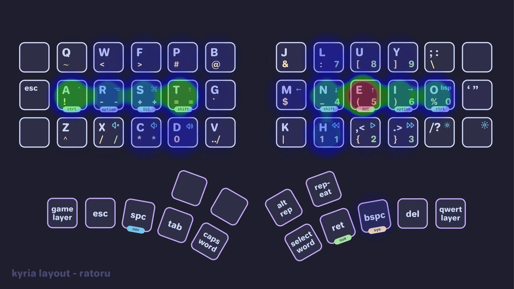
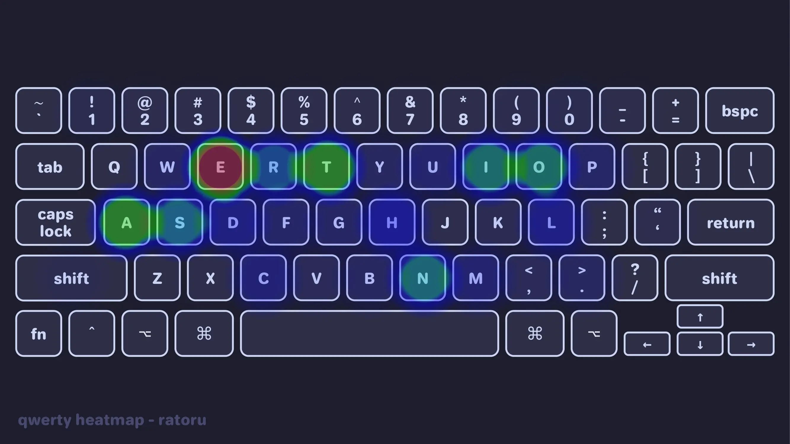
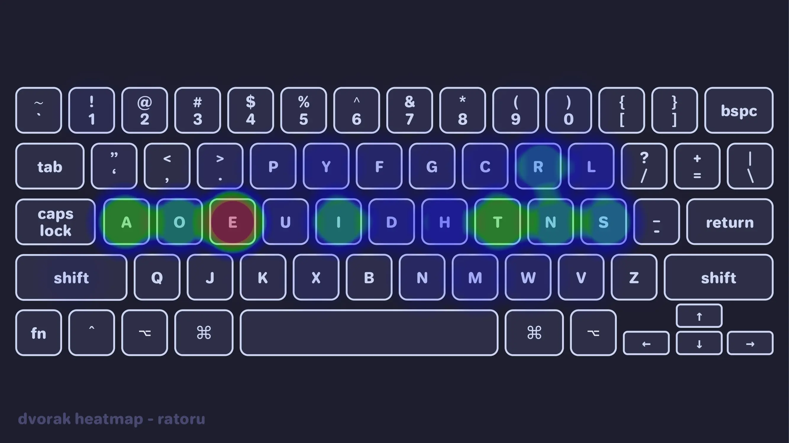
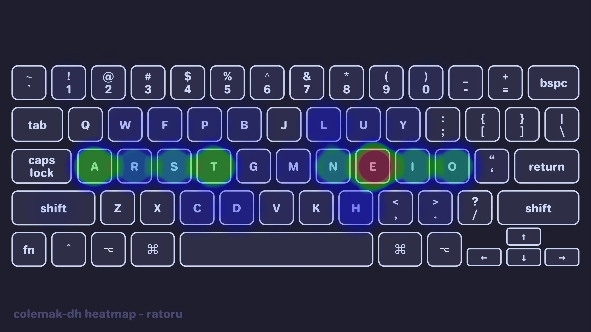

I have healthier hands and am a more efficient typer because I designed my own keyboard layout.

This guide will take you from having never heard about what a keyboard layout is all the way to using your custom layout on a mechanical keyboard via `QMK`. Even though the ergonomic keyboard community is very kind and helpful, most of the information is buried across Reddit, old blogs, and even older internet forums. I will walk you through all the necessary information a complete beginner needs to start building a custom layout.

Let's begin our dive down the massive rabbit hole that is keyboard layouts.

## The Basics

You just came off your high discovering [ergonomic keyboards](https://ratoru.com/blog/the-perfect-ergonomic-keyboard) and have now realized that you need to put all the keys you just lost somewhere.

Let's take this opportunity to revamp your typing habits and shortcuts to make your typing more efficient. In the long run, good typing posture and shorter finger movements can even help prevent repetitive strain injury (RSI).

Building your custom layout will consist of 3 steps:

1. Chose a keyboard layout for your base layer, for example `Qwerty`, `Gallium`, or `Canary`.
2. Customize the layout to match your specific keyboard. This is the fun part since you get to infuse your keyboard with superpowers.
3. Install your custom layout by flashing firmware to your keyboard, for example by using [QMK Firmware](https://qmk.fm/).

Don't worry if these steps seem daunting. Nothing beats experimenting with all the different features and seeing what you like. You will become a better typer along the way.

## Picking a Base Layout

:::note
Switching base layout is a small optimization that requires a lot of training. If your main goal is typing speed, or you don't want to learn a new way to type go straight to [part 2 of this guide](https://ratoru.com/blog/layout-customizing). Now, let me convince you why you should switch.
:::

If you are like me, you typed on a `Qwerty` [^1] your entire life; turns out `Qwerty` is garbage in terms of ergonomics.

[^1]: The `qwerty` layout is what you see on any regular keyboard. It's named after the first letters in the upper row.

Certain letters and bigrams appear much more often in text or code than others. Unfortunately, `Qwerty` was not designed to make the most frequent letters and bigrams the most comfortable to hit. Naturally, many keyboard layouts have since been designed that optimize specifically for typing comfort.

The three most popular layouts are `Qwerty`, `Dvorak`, and `Colemak(-DH)`. The images below are heatmaps for these three layouts that were generated using 10000 sentences from Wikipedia. The first time I saw these heatmaps, I was shocked. I recommend you watch [this video](https://youtu.be/gRtS-XACO6o?t=42) to learn a little bit about the history of these (and other) layouts.





Unfortunately, every English keyboard runs on `Qwerty`, so switching layouts does have drawbacks. Read through Pascal Getreuer's excellent article on [alternate keyboard layouts](https://getreuer.info/posts/keyboards/alt-layouts/index.html) and decide whether you want to learn one.

For lazy readers here is my quick summary. The primary motivation for switching layouts is **improved typing comfort**. Improving speed should not weigh into your decision. You will likely see better results by taking advantage of the muscle memory you already have and drilling `qwerty`. On the other hand, alternate keyboard layouts like `Colemak-DH` and `Sturdy` are significantly more ergonomic than `qwerty`.

> Your fingers on QWERTY move 2.2x more than on Colemak. QWERTY has 16x more same hand row jumping than Colemak. There are 35x more words you can type using only the home row on Colemak.
> -- [colemak.com](https://colemak.com/)

Learning a new layout is hard! It will take a few months of practice to get up to a usable typing speed (>40 wpm). From there it will take even longer to get to the >80 wpm range that I would consider fast typing. You will have to use `qwerty` when using someone else's computer, although I have had no problem switching between layouts [^2].

[^2]: I keep my muscle memory in order by using `qwerty` on row-staggered keyboards and `Gallium` on column-staggered keyboards!

If you want to switch layouts, but can't decide on a specific one, go with `Gallium`. [Gallium](https://github.com/GalileoBlues/Gallium) is a modern layout that has been battle-tested by the community.

Personally, I am currently using `Gallium`. I can recommend looking at `Graphite`, `Canary`, and `Magic Sturdy`, as well. Each layout has its own feel. I **highly recommend** skipping old layouts like `Dvorak` and `Colemak-DH` since they were created without the use of layout analyzers. Layouts created post 2022 simply have much better typing statistics. If you are already committing the time to learn something new, might as well learn the current cutting edge.

## The Stats

Modern layout analyzers use a few key statistics to analyze the effectiveness of a layout. Check out the [cyanophage playground](https://cyanophage.github.io/index.html) for a detailed breakdown of all kinds of layouts! For an in-depth explanation read through this [layout doc](https://docs.google.com/document/d/1W0jhfqJI2ueJ2FNseR4YAFpNfsUM-_FlREHbpNGmC2o).

| Metric           | What's that?                                                                                                                                           | Qwerty Example |
| ---------------- | ------------------------------------------------------------------------------------------------------------------------------------------------------ | -------------- |
| SFB              | Same finger bigrams are two consecutive key presses with the same finger. This is universally hated and one of the key stats we're trying to minimize. | `ed`           |
| Alternation      | Alternating hands when typing. Alternation is great, but conflicts with rolls.                                                                         | `so`           |
| Rolls (in / out) | Rolling your fingers in or out when typing. This is generally liked. Some layouts prioritize rolls over alternation or vice versa.                     | `asd`          |
| (Bad) Redirects  | Changing direction mid roll. It's a bad redirect if it doesn't include the index. High rolls usually mean high redirects.                              | `das`          |
| Scissors         | Neighboring fingers stretch in the opposite direction.                                                                                                 | `xr`           |
| Usage            | How much each finger, row, and hand is used.                                                                                                           |                |
| LSB              | Lateral stretch bigrams. Two key presses where you need to stretch your hand. Some people are not bothered by this.                                    | `yo`           |

Designing an ideal layout basically comes down to optimizing these statistics for a given text. At some point the layout designer will have to start making tradeoffs, at which point it is down to personal preference. For English layouts a common trend has emerged among new layouts. They have a vowel block on the right hand for high alternation. You will see this if you look at layouts like `Gallium` and `Graphite` [^3].

[^3]: The adventerous are also exploring keymaps with _magic keys_ like `Magic Sturdy`. A magic key outputs a different key depending on the previous key. This lets you write bad bigrams or trigrams in a layout through the magic key, thereby avoiding the problem.

This is the Gallium layout and its statistics breakdown.

```text
gallium_colstag (GalileoBlues)
  b l d c v  j y o u ,
  n r t s g  p h a e i
  x q m w z  k f ' ; .

Statistics (Monkeyracer):
  Alt: 32.63%
  Rol: 44.64%   (In/Out: 19.56% | 25.08%)
  One:  2.65%   (In/Out:  0.45% |  2.21%)
  Rtl: 47.29%   (In/Out: 20.00% | 27.29%)
  Red:  2.27%   (Bad:     0.22%)

  SFB:  0.80%
  SFS:  5.06%   (Red/Alt: 0.81% | 4.26%)

  LH/RH: 46.56% | 53.44%
```

Now compare this to the abysmal Qwerty stats.

```text
gallium_colstag (new) - Qwerty (old)
  ~ ~ ~ ~ ~  ~ ~ ~ ~ ~ ~ ~ ~
  ~ ~ ~ ~ g  ~ ~ ~ ~ ~ ~
  ~ ~ ~ ~ ~  ~ ~ ~ ~ ~

Stats Difference (new vs old):
  Alt: 13.18%
  Rol:  6.88%   (In/Out: -1.01% |  7.90%)
  One:  0.51%   (In/Out: -0.57% |  1.08%)
  Rtl:  7.40%   (In/Out: -1.58% |  8.98%)
  Red: -3.80%   (Bad:    -0.17%)

  SFB: -8.98%
  SFS: -7.63%   (Red/Alt: -5.85% | -1.78%)

  LH/RH: -7.98% | 7.98%
```

Things to keep in mind:

- The analyzed corpus influences the statistics. Do you write a lot of English, Code, German?
- Pick a layout that optimizes statistics you actually care about!
  - I personally don't mind lateral stretches since I have big hands.
  - But I dislike redirects! This is the reason I switched away from `Colemak-DH`.
- Do you want an alpha key on the thumb? I personally don't because I worry about overutilizing my thumbs.

## Practicing

If you'd like to switch, I recommend using the following websites to train:

1. Start with [keybr.com](https://www.keybr.com/) to learn the layout.
2. Supplement practice with ngram type.
3. Once you can type decently, use [monkeytype.com](https://monkeytype.com/). It is recommended to change the corpus on `monkeytype` from `🌐 english` to `🌐 english 5k` right above the text, so that you come across more words while practicing.

I recommend at least trying a different layout, although you won't get any good without a serious commitment.

## Next steps

Now it is time to customize your layout for your specific keyboard. Aditionally, you need to add symbols, numbers, and all the other things that don't fit on your keybaord. Along the way you will be able to create keys that select entire words or type `../` with one press. I show you how to do it in [part 2 of this guide](https://ratoru.com/blog/layout-customizing).
