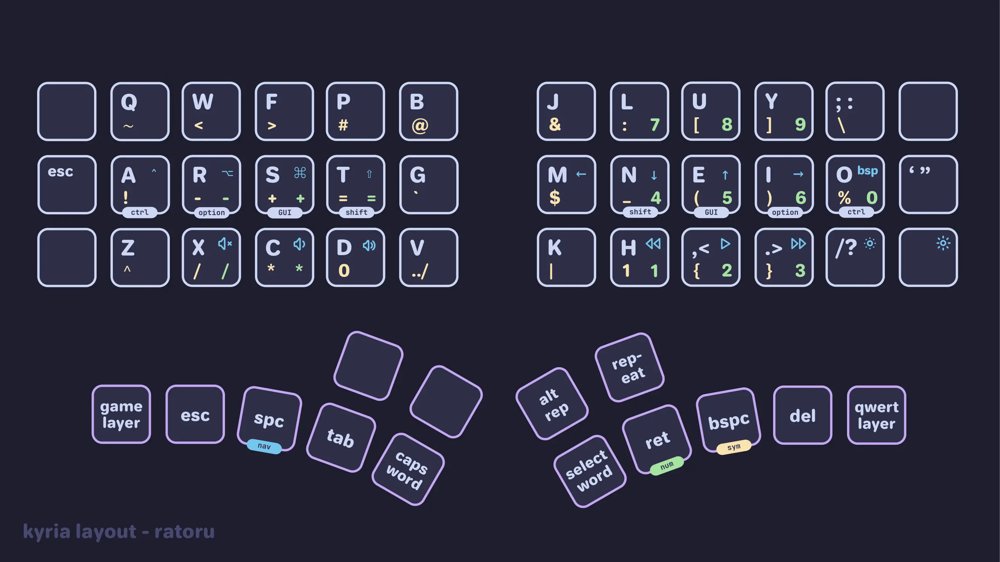
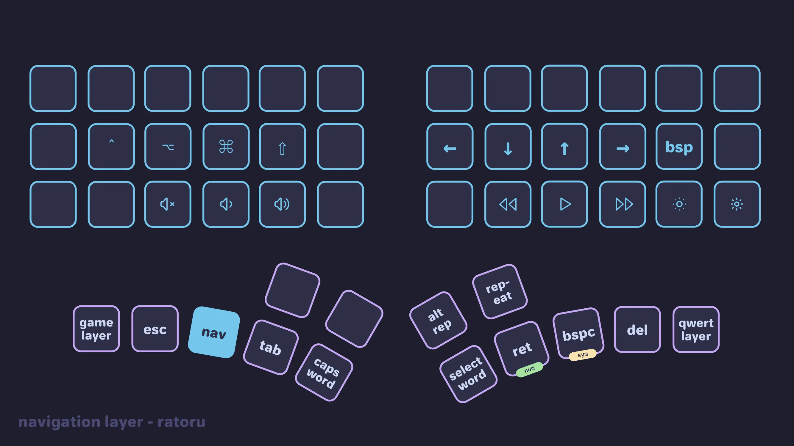
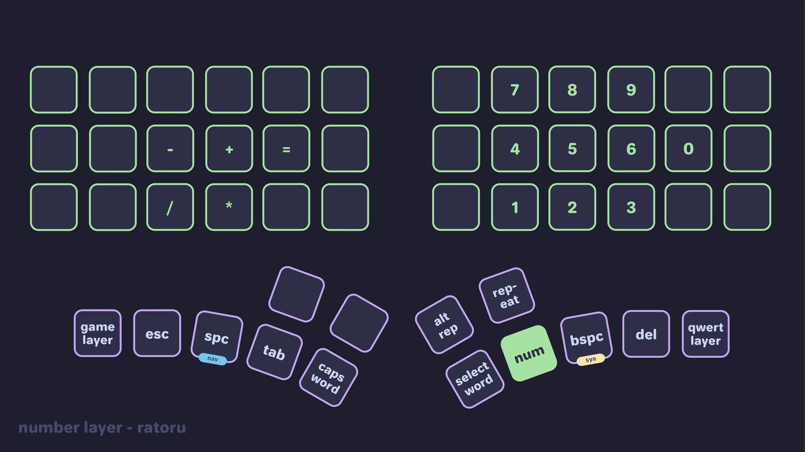

Now that you have a basic layout, it is time to give your layout superpowers and adapt it to your specific keyboard.

Custom layouts enable you to create keys that select the entire word under your cursor, perform differently when tapped vs held, repeat the last action, and so on. Which layout is optimal for you depends on your specific use case, though. That's why I will first show you some of the most common features and terminology. Afterwards, I will show you my layout for the `Kyria rev3` more as inspiration than anything else.

At the end, you will have all the tools you need to customize your own layout.

:::note
This is part 2/3 of my cutom keyboard layout series. I recommend you read [part 1](https://ratoru.com/blog/layout-base) before continuing.
:::

## Example layouts

There are too many symbols and characters to fit on your small keyboard. That's why you will need layers! I recommend you quickly read [What are layers?](https://blog.splitkb.com/how-to-work-with-small-keyboards/) before we dive into what you can do with each layer. It is also useful to refer to an example right from the start. Here is a list of keymaps that range from basic to very advanced and include basically all the features that we will go through:

- [Default Kyria layout](https://github.com/qmk/qmk_firmware/blob/master/keyboards/splitkb/kyria/keymaps/default/readme.md). Basic, but illustrates the use of layers well.
- [Getreuer's keymap](https://github.com/getreuer/qmk-keymap). My keymap is based heavily off of this one. It has a great symbol layer for coding.
- [Miryoku](https://github.com/manna-harbour/miryoku/). A very popular keymap that builds off of `Colemak-DH`.
- [Precondition's keymap](https://github.com/precondition/dactyl-manuform-keymap). This keymap has great tricks.
- [Pnohty](https://github.com/rayduck/pnohty/tree/master). `Colemak-DH` with an optimized layer for `Python`.
- [Callum's keymap](https://github.com/callum-oakley/qmk_firmware/tree/master/users/callum). Alternative to home row mods.
- [My keymap](https://github.com/ratoru/qmk_userspace). `Colemak-DH` with an optimized symbol layer for coding and a `vim` friendly navigation layer.

## Additional layers

You can add many additional layers to your keyboard. These layers cover numbers, symbols, navigation, function keys, volume, brightness, etc. Comparing different keyboard layouts you will find that most layouts share a set of common layers.

- `Numbers layer`. Arranges all numbers in a line or like a numpad.
- `Symbols layer`. Contains all symbols. Heavily used by programmers.
- `Navigation layer`. Brings navigation shortcuts to the home row. Often called `Extend layer`.
- Additional layers. This can be a `media layer` for volume, `fun layer` for function keys, `gaming layer` for games where you need numbers and `Qwerty`, etc.

Once again, depending on your use case you can combine or separate these layers further as needed. The navigation layer is especially popular. You should read this excellent blog post introducing the [Extend Layer](https://dreymar.colemak.org/layers-extend.html). The numbers layer mainly comes down to preference.

As a programmer the symbols layer is crucial to me. While there are many heavily optimized keyboard layouts for letters, it is much harder to find a good one for symbols. [Designing a Symbol Layer](https://getreuer.info/posts/keyboards/symbol-layer/index.html) by Getreuer is the best writeup on the topic I could find. Additionally, you should take a look at the [character frequencies of programming languages](http://xahlee.info/comp/computer_language_char_distribution.html) to inform where you put your symbols. The [Arensito layout](http://www.pvv.org/~hakonhal/main.cgi/keyboard) also has a good programming layout.

Below are the layers I came up with.

## Extra Functionality

It is time to get familiar with some of the basic functionality that `QMK Firmware` provides. We use [QMK](https://qmk.fm/) to program our mechanical keyboards. Thomas Baart has a great series that goes over the [basics of QMK](https://thomasbaart.nl/category/mechanical-keyboards/firmware/qmk/qmk-basics/). Skim through it to get a rough understanding of what we are about to do. Don't worry about the actual code, we will do that in Part 3.

One of the most commonly used features is called home row mods. QMK's `mod-taps` allows us to place the modifiers `⇧ Shift`, `⎈ Control`, `⎇ Alt`, and `◆ GUI` on the home row. Configuring home row mods to prevent accidental triggers is known to be tricky. Before deciding whether home row mods are the right thing for you, read through Precondition's [home row mods guide](https://precondition.github.io/home-row-mods), which is the source of truth regarding this topic. Additionally, check out [Achordion](https://getreuer.info/posts/keyboards/achordion/index.html), which aims to make home row mods more consistent.

`QMK` provides a lot of functionality out of the box by using their keycodes. Always check their [list of keycodes](https://docs.qmk.fm/#/keycodes) to see if something is natively supported. Here is a list of official `QMK` features that got me excited while creating my custom layout.

- [Caps Word](https://docs.qmk.fm/#/feature_caps_word). Caps Lock for one word only.
- [Repeat Key](https://docs.qmk.fm/#/feature_repeat_key). Repeat the last key stroke.
- [One Shot Keys](https://docs.qmk.fm/#/one_shot_keys). Applies a modifier to the next key stroke.
- [Mod-Tap](https://docs.qmk.fm/#/mod_tap). Allows you to use your layer keys for typing characters.

Aside from official features you can also write custom functions that execute when a key is pressed. Getreuer once again has a great [guide covering macros](https://getreuer.info/posts/keyboards/macros/index.html). Here are my favorite ones.

- [Word Selection](https://getreuer.info/posts/keyboards/select-word/index.html). Select entire current word. `viw` in Vim.
- [Layer Lock Key](https://getreuer.info/posts/keyboards/layer-lock/index.html). Keeps you in the current layer until disabled.
- [TD_DOT](https://github.com/precondition/dactyl-manuform-keymap#keymap-tricks). Double tap the dot key to produce `. [One-Shot Shift]`
- Key that produces `../`.
- [Window swap](https://github.com/callum-oakley/qmk_firmware/tree/master/users/callum#swapper). Sends `cmd-tab`, but holds `cmd` between consecutive keypresses.

You can see what macros I use by looking at my [qmk keymap](https://github.com/ratoru/qmk_keymap) on GitHub or at the top of this article.

## Next steps

All that is left to do is actually creating the firmware and flashing (installing) it. I show you how to do it in [part 3 of this guide](https://ratoru.com/blog/layout-flashing).
