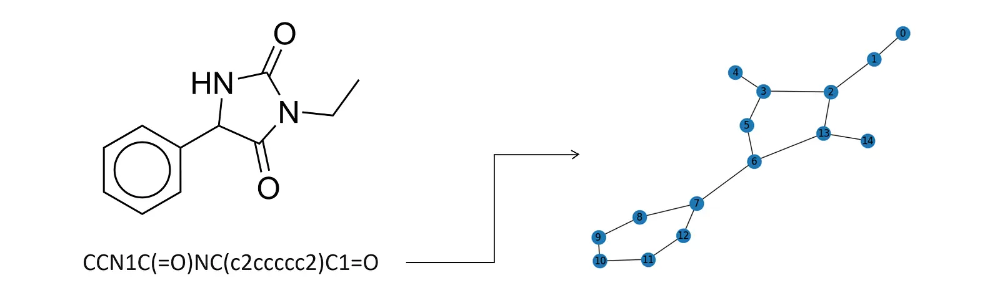
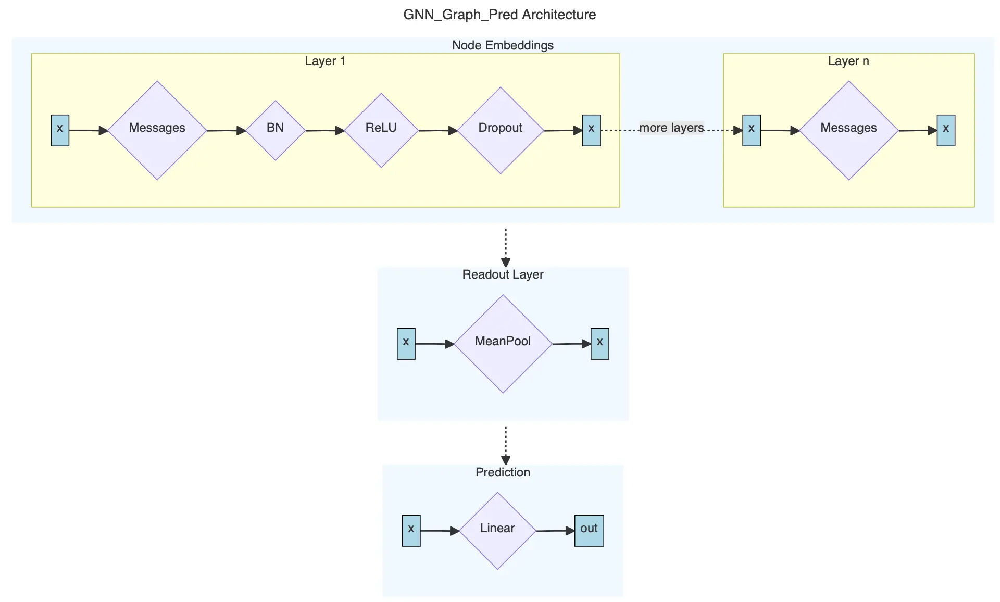
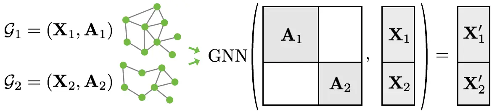
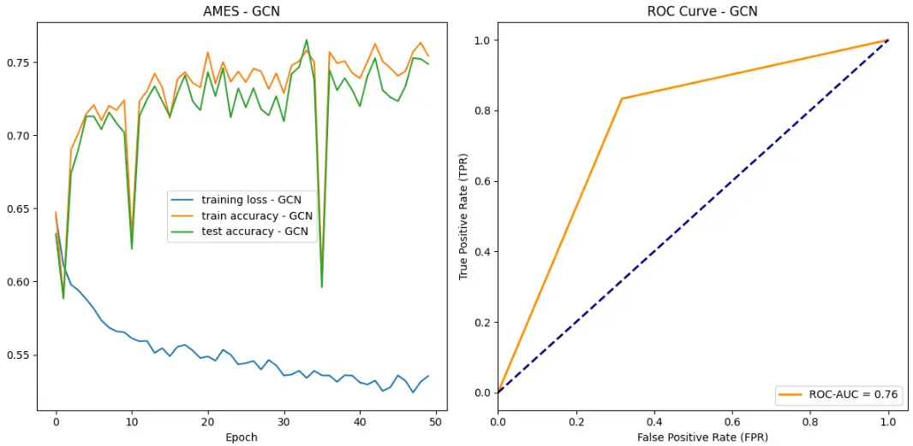
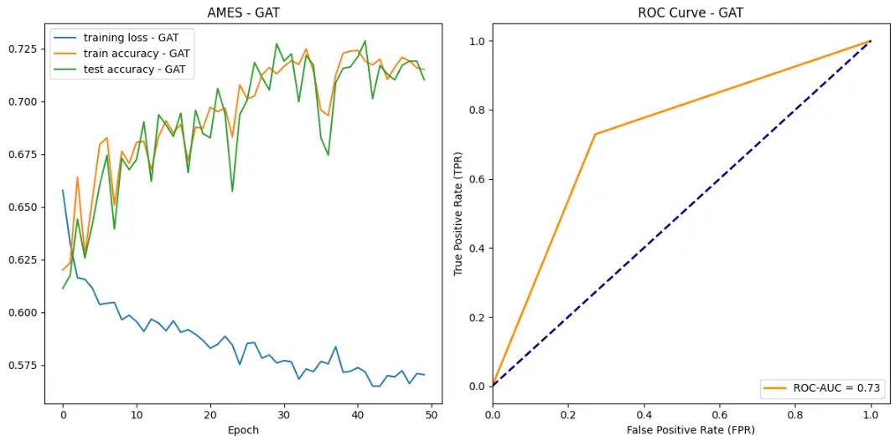
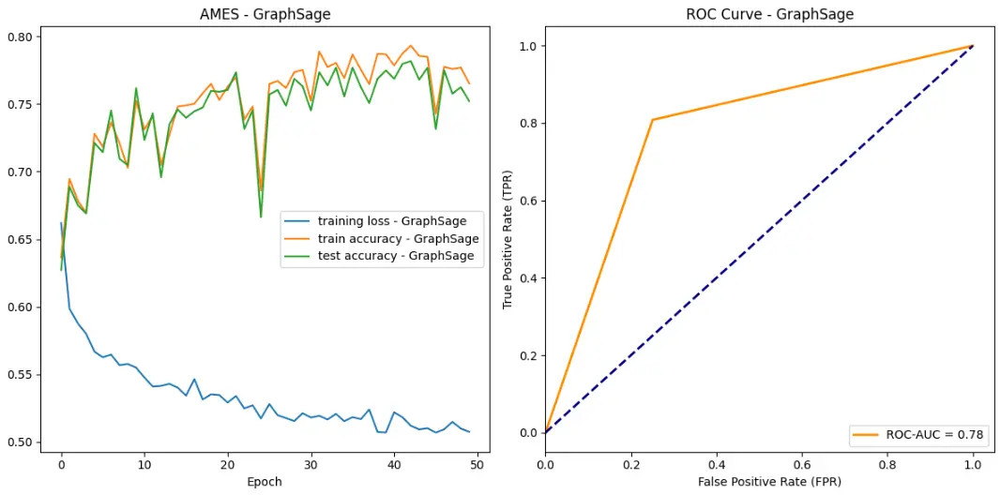
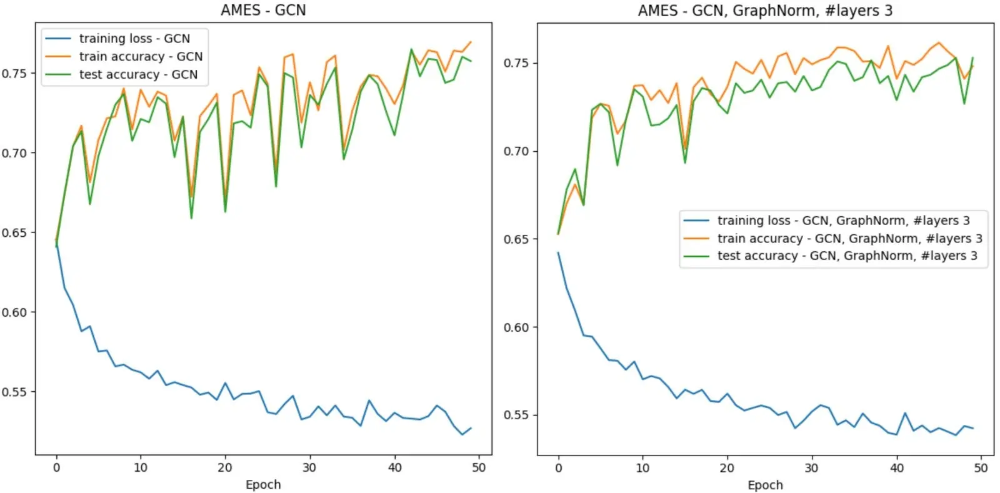
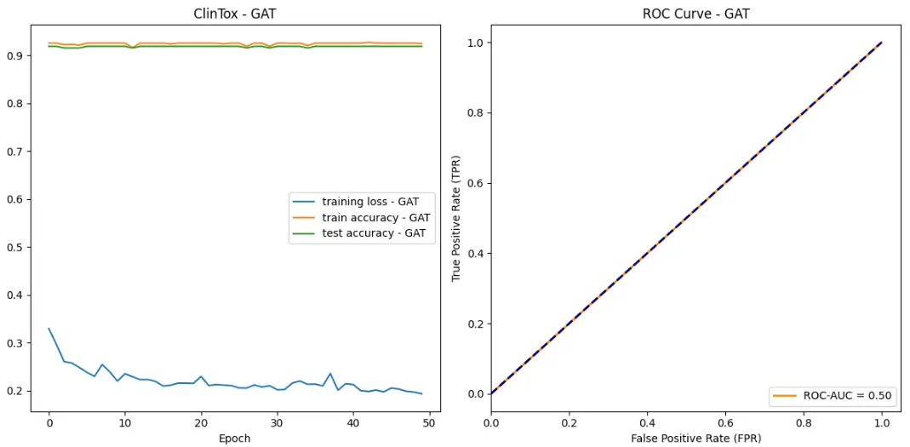
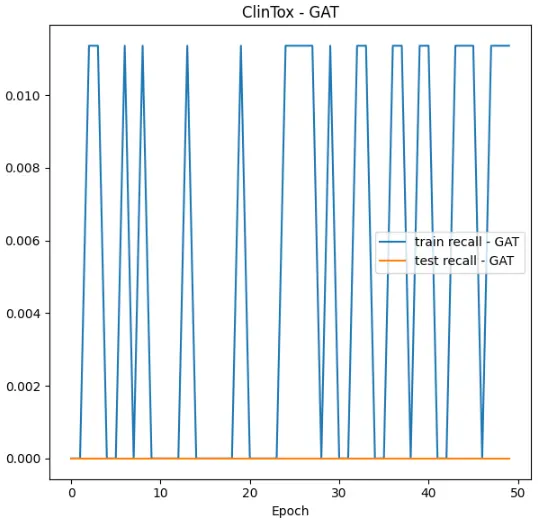
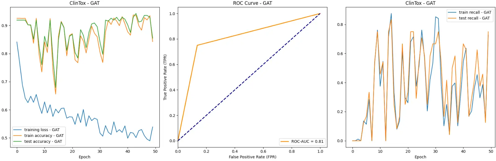

Drugs can be toxic - and we can predict which ones are by using Graph Neural Networks.

Drugs can be represented as graphs, which enables us to use Graph Neural Networks to predict their properties. We are going to show you how to use a drug's SMILE code to predict whether it is toxic or not using a GCN, GAT, and GraphSage model. Along the way we will explore how these models compare, how to improve their performance, and where they fail.

Let's identify some drugs.

## Predicting Drug Toxicity

:::note
Follow along by reading [all the code](https://colab.research.google.com/drive/1TZT2ehGfRbXwIgmllfXWMJl2ZlQzyAxh) (with explanations!) for this post.
:::

What you can expect in this post:

- Background on SMILES notation.
- Dataset analysis and preprocessing.
- Explanation and implementation of GCN, GAT, and GraphSage.
- Training tricks and tweaks like batching and BatchNorm .
- A failure case of GNNs and how to resolve it using weighted loss.

## Background

We rely on Simplified Molecular-Input Line-Entry System (SMILES) notation to represent the drugs in our datasets. SMILES notation provides a compact textual representation of molecular structures, making it a suitable input for machine learning models.
We will take this representation a step further by converting SMILES strings into graph structures, where atoms represent nodes, and bonds represent edges. These molecular graphs will serve as the foundation for our graph neural network(s), which will perform a graph-level prediction task. Here is an example of the SMILES code conversion.



Accurate toxicity prediction not only accelerates the drug discovery process but also safeguards human health by identifying compounds with undesirable side effects early in development. A more sophisticated model than what we will be building could be used during drug development to predict whether a given drug will get approved before investing money and resources into its development and testing.

## The Data

We are going to use datasets provided by the Therapeutics Data Commons, an open-science platform with AI/ML-ready datasets. Our chosen datasets include over 8,500 drugs (as SMILE codes) and their respective toxicity rating [5]. Specifically, we are going to look at these datasets:

- AMES dataset, which contains over 7,200 drugs that might induce genetic alterations resulting in cell death or other severe adverse effects. (The Ames test is a brief assay for bacterial reverse mutations, capable of identifying numerous compounds that can cause genetic damage and induce frameshift mutations.) [2]
- ClinTox dataset, which includes over 1,400 drugs that have failed clinical trials for toxicity reasons and drugs that are associated with successful trials [3].

## Preprocessing

Therapeutics Data Commons provides many different datasets on toxic drugs that are all structured similarly. Thus, if we build reusable code, we can swap out the dataset without much effort. We are going to accomplish this by implementing the `ToxicDataset` class, which does the following.

1. Import the dataset. We use `tdc`, a library from Therapeutics Data Commons, to import the datasets we are going to use throughout this colab.
2. Split data into train, and test set. tdc provides us with a convenient method for splitting our data into a training, validation, and test set called `get_split()`. For our purposes, we do not need a seperate validation set, so we will combine it with the training set.
3. SMILE to graph conversion. We are going to use Open Graph Benchmarks's [smiles2graph implementation](https://github.com/snap-stanford/ogb/blob/master/ogb/utils/mol.py). It uses `rdkit`'s `MolFromSmiles` function to convert the SMILE's code into a graph. [4]
4. Convert to Data format. From there we just need to convert the output into PyG's Data and DataLoader format. Implementation can be found in `drug2data` and `create_data_loaders`.
5. Display information. We should always take a look at our dataset before using it. This will be very useful later on.

Most of this code is self-explanatory, so we will only show a few snippets of the class here. Check the [Colab](https://colab.research.google.com/drive/1TZT2ehGfRbXwIgmllfXWMJl2ZlQzyAxh) for a detailed rundown of the code!

```python
class ToxicDataset():
    def __init__(self, dataset_name: str):
        self.dataset_name = dataset_name
        # Download and split dataset
        self.split = self.__create_data_split()
        # Transform split into lists of Data objects
        self.data_list_train = [drug2data(drug) for _ , drug in self.split['train'].iterrows()]
        self.data_list_test = [drug2data(drug) for _ , drug in self.split['test'].iterrows()]
```

DataLoaders will allow us to easily iterate over the data in batches, which is great for training. We'll go into more detail later.

```python
def create_data_loaders(self, batch_size: int) -> Tuple[DataLoader, DataLoader]:
    """Given a batch size, returns a list of DataLoader objects for `train` and `test`.

    Parameters
    ----------
    batch_size: int
       The batch size for the DataLoader.

    Returns
    -------
    Tuple[DataLoader, DataLoader]
        Lists of DataLoader objects for training, and testing.
    """
    train_loader = DataLoader(self.data_list_train, batch_size=batch_size, shuffle=True)
    test_loader = DataLoader(self.data_list_test, batch_size=batch_size, shuffle=False)
    return train_loader, test_loader
```

## The Models

Let's delve deeper into the functioning of a Graph Neural Network (GNN). Essentially, a GNN operates by taking a graph as its input (in our case a drug molecule), which is depicted as a collection of nodes interconnected by edges. The primary objective of a GNN is to acquire a function that links each node to a vector embedding, encompassing its structural attributes and relational context. We can then train the GNN to perform one of the following tasks: node classification, link prediction, or graph classification. (There are others as well.) Since we want to predict whether a given drug, i.e. the entire graph, is toxic, we will be designing a graph classification GNN.

The structure of a GNN layer involves the three main following steps:

1. Message Computation. Here, a linear transformation is applied to the embedding of each node, essentially generating "messages" that are sent from each node to its connected neighbors.
2. Aggregation. Each node gathers messages from its neighboring nodes. These messages are merged utilizing a permutation-equivariant function, like mean, max, or sum.
3. Update. This step involves the utilization of the aggregated message to revise the representation of the node. Numerous models integrate an extra linear transformation and a residual connection at this stage.

In this project, we will be specifically experimenting with the aggregation step, which is the step that generates our embeddings. We will be trying out three different GNN architectures to see which ones succeed at classifying the drugs. More specifically, our three models will be a GCN, GraphSAGE, and GAT.

### Graph Convolutional Network (GCN)

GCNs operate by changing the messages between neighboring nodes' features, gathering these changed messages (e.g., by averaging), and then applying non-linear adjustments to this combined information to generate the unique vectors that represent the specific node you're focusing on.

We use PyG's built-in `GCNConv` layer to achieve this message aggregation. Below, you can see how the embedding is formed, with the summation of all the information from incoming nodes followed by some activation [6]. $a + b = 5$

$$h_v^{(l)} = \sigma \left(\sum_{u \in N(v)} W^{(l)} \frac{h_u^{(l-1)}}{|N(v)|}\right)$$

### GraphSAGE

Now, we will be trying out GraphSAGE. GraphSAGE works by creating node embeddings, gathering info from their nearby area through a bunch of sampling and combining steps. What's cool about GraphSAGE is that it lets you choose different ways to combine this info, which is handy for customizing the model for specific jobs. To make this work, we used PyG's built-in `SAGEConv` layer, which performs aggregation according to the math below [7].

$$h_v^{(l)} = \sigma \left(W^{(l)} \cdot \text{CONCAT}(h_v^{(l-1)}, \text{AGG}(\{h_u^{(l-1)}, \forall u \in N(v) \})) \right)$$

### Graph Attention Networks (GAT)

Finally, we will be trying out a GAT. GATs use attention tricks, so the model can decide how important each nearby node is when it mixes their features. This could be super helpful for our drug classification issue because it lets the model pay more attention to crucial molecular patterns linked to toxicity instead of getting distracted by less important atoms like random carbons.

We used PyG's built-in implementation `GATConv` to achieve the desired layer, which is founded of the following math [8].

$$h_v^{(l)} = \sigma\left(\sum_{u \in N(v)} \alpha_{vu} W^{(l)} h_u^{(l-1)}\right)$$

## Our Implementation

Graph-level prediction tasks like ours usually follow these three steps.

1. Compute embeddings for all nodes in a graph using a specific model's architecture, e.g. GCN.
2. Compute a graph-level embedding by aggregating all the node embeddings into a unified graph embedding . This is called the readout layer. For our purposes, simply averaging all the node embeddings is good enough. We can use [torch_geometric.nn.global_mean_pool](https://medium.com/r/?url=https%3A%2F%2Fpytorch-geometric.readthedocs.io%2Fen%2Flatest%2Fmodules%2Fnn.html%23torch_geometric.nn.glob.global_mean_pool) to accomplish that.
3. Lastly, train a classifier on the pooled graph embedding. We can use [torch.nn.Linear](https://medium.com/r/?url=https%3A%2F%2Fpytorch.org%2Fdocs%2Fstable%2Fgenerated%2Ftorch.nn.Linear.html) for this in our implementation.

Sometimes Step 1 is decomposed into a separate class, which is then invoked in the GNN graph prediction class. There is no need to train the decomposed class separately. In our case, we will have only one class for all 3 steps. Our architecture looks like this.



Since we want to make our code as reusable as possible, we can build our class agnostic of the underlying message passing architecture. Our class will receive message_pass as a passed in parameter. The parameter is a [message passing function](https://medium.com/r/?url=https%3A%2F%2Fpytorch-geometric.readthedocs.io%2Fen%2Flatest%2Fmodules%2Fnn.html%23convolutional-layers) of type `MessagePassing`. This will allow us to reuse the same class for different models since PyG conveniently already has `GCNConv`, `SAGEConv`, and `GATConv` for us!

```python
class GNN_Graph_Pred(torch.nn.Module):
    """Generates graph-level predictions. """
    def __init__(self, message_pass, input_dim: int, hidden_dim: int, output_dim: int, num_layers: int, dropout: float, norm=BatchNorm):
        """Initializes graph-level prediction GNN. Uses MessagePass to compute node embeddings.

        Parameters
        ----------
        message_pass : MessagePass
            The message passing layer, e.g. GCNConv, GATConv, or SAGEConv.
        input_dim: int
            The input dimension.
        hidden_dim: int
            The dimension of the hidden layers.
        output_dim: int
            The dimension of the output.
        num_layers: int
            The number of layers. Must be at least 2.
        dropout: float
            The probability to use for dropout.
        norm: Optional[Module]
            The normalization layer to use, e.g. BatchNorm or GraphNorm.
        """
        super(GNN_Graph_Pred, self).__init__()

        # 1. Node embeddings
        # First layer dimensions: input -> hidden
        self.convs = torch.nn.ModuleList([message_pass(input_dim, hidden_dim)])
        # All other layer dimensions: hidden -> hidden.
        # This is because we want to use the embeddings from the last layer in the readout layer.
        self.convs.extend([message_pass(hidden_dim, hidden_dim) for _ in range(1, num_layers)])
        # A list of normalization layers
        self.norms = torch.nn.ModuleList([norm(hidden_dim) for _ in range(num_layers - 1)])
        # Probability of an element getting zeroed
        self.dropout = dropout

        # 2. Readout layer
        self.pool = global_mean_pool

        # 3. Output layer
        self.linear = torch.nn.Linear(hidden_dim, output_dim)
```

The forward pass is implemented as follows:

```python
def forward(self, batched_data):
    """Takes a mini-batch of graphs and returns the predicted graph property for each graph."""
    # Extract important attributes of our mini-batch
    x, edge_index, batch = batched_data.x, batched_data.edge_index, batched_data.batch

    # 1. Obtain node embeddings
    for i in range(len(self.norms)):
        x = self.convs[i](x, edge_index)
        x = self.norms[i](x)
        x = F.relu(x)
        x = F.dropout(x, self.dropout, self.training)
    x = self.convs[-1](x, edge_index)

    # 2. Readout Layer
    x = self.pool(x, batch)

    # 3. Final classifier
    out = self.linear(x)

    return out
```

## Training and Testing Infrastructure

Training and testing our models will basically be the same for all our models. Thus, this is a good opportunity to write reusable code! Let us create an `Evaluator` class that we can give a model and it trains, tests, and produces all metrics and plots we would need. This is done by the following run_eval function.

```python
# In class Evaluator
def run_eval(self, model, model_name: str, dataset: ToxicDataset, batch_size: int, epochs: int, weighted_loss=False):
    """Given a model, model_name, dataset, batch size, and number of epochs
    trains and evaluates the model.

    Parameters
    ----------
    model:
        The model to train.
    model_name: str
        The name of the model.
    dataset: ToxicDataset
        The wrapper for the dataset to train on.
    batch_size: int
        The batch size to use while training and testing.
    epochs: int
        The number of epochs to train for.
    weighted_loss: Optional[bool]
        If True, uses a weighted loss function. Default is False.
    """
    train_loader, test_loader = dataset.create_data_loaders(batch_size)
    optimizer = torch.optim.Adam(model.parameters(), lr=0.01)
    loss_fn = torch.nn.CrossEntropyLoss()
    if weighted_loss:
        pos_weight = self.calculate_weights(dataset)
        loss_fn = torch.nn.BCEWithLogitsLoss(pos_weight=pos_weight)

    # Train and evaluate model for # of epochs.
    losses = []
    train_accs = []
    valid_accs = []
    test_accs = []
    best_test_acc = 0
    best_preds = torch.tensor([])

    best_test_precision = 0
    best_test_recall = 0
    train_precisions = []
    test_precisions = []
    train_recalls = []
    test_recalls = []

    for epoch in tqdm(range(epochs), "Epoch"):
        # Train and test
        loss = self.train(model, train_loader, optimizer, loss_fn, weighted_loss)
        train_acc, _ = self.test(model, train_loader)
        test_acc, preds = self.test(model, test_loader)
        train_precision, train_recall = self.precision_recall(model, train_loader)
        test_precision, test_recall = self.precision_recall(model, test_loader)

        # Save results for plots
        if test_acc > best_test_acc:
            best_preds = preds
            best_test_acc = test_acc
        if test_precision > best_test_precision :
            best_preds = preds
            best_test_acc = test_acc
        if test_recall > best_test_recall:
            best_preds = preds
            best_test_acc = test_acc
        losses.append(loss)
        train_accs.append(train_acc)
        test_accs.append(test_acc)
        train_precisions.append(train_precision)
        test_precisions.append(train_precision)
        train_recalls.append(train_recall)
        test_recalls.append(test_recall)

    print(f"----- {model_name} on {dataset.dataset_name}  -----")
    print(f"Maximum training set accuracy: {max(train_accs)}")
    print(f"Maximum test set accuracy: {max(test_accs)}")

    print(f"Maximum training set precision: {max(train_precisions)}")
    print(f"Maximum test set precision: {max(test_precisions)}")

    print(f"Maximum training set recall: {max(train_recalls)}")
    print(f"Maximum test set recall: {max(test_recalls)}")

    print(f"Minimum loss: {min(losses)}")
    print(f"ROC-AUC score: {roc_auc_score(dataset.get_test_labels(), best_preds)}")
    self.__plot(dataset, model_name, losses, train_accs, test_accs, best_preds, test_recalls, train_recalls, test_precisions, train_precisions)
```

The `train` function looks as follows. (We will add the weighted loss later.)

```python
def train(self, model, loader: DataLoader, optimizer, loss_fn, weighted_loss = False) -> float:
    """Given a model, loader, optimizer, and loss function trains the model for one epoch."""
    model.train()
    total_loss = 0

    # Iterate in batches over the training dataset.
    for data in loader:
        optimizer.zero_grad()       # Clear gradients.
        out = model(data)           # Perform a single forward pass.
        loss = None
        if weighted_loss:
            targets = torch.nn.functional.one_hot(data.y, num_classes=2).float()
            loss = loss_fn(out, targets) # Compute the loss.
        else:
            loss = loss = loss_fn(out, data.y)
        loss.backward()             # Derive gradients.
        optimizer.step()            # Update parameters based on gradients.
        total_loss += loss.item() * data.num_graphs
    return total_loss / len(loader.dataset)
```

The `test` function also returns the actual predictions so that we can plot the ROC-AUC curve later.

```python
def test(self, model, loader: DataLoader):
    """Given a model and loader returns the accuracy of the model and the predictions."""
    model.eval()

    correct = 0
    all_pred = torch.tensor([])
    # Iterate in batches over the training/test dataset.
    for data in loader:
        out = model(data)
        pred = out.argmax(dim=1)  # Use the class with highest probability.
        all_pred = torch.cat((all_pred, pred)) # Save predictions for ROC-AUC calculations.
        correct += torch.sum(pred == data.y).item() # Check against ground-truth labels.
    ratio = correct / len(loader.dataset) # Derive ratio of correct predictions.
    return ratio, all_pred
```

## Improving Training

Since we want to optimize our GPU utilization, we are going to batch the graphs before inputting them into a GNN. Our graphs in the datasets are small, so this is good idea. PyTorch Geometric achieves parallelization across a number of examples by stacking adjacency matrices in a diagonal fashion (creating a giant graph that holds multiple isolated subgraphs). Node and target features are simply concatenated in the node dimension:[^1]

[^1]: Source [Stanford CS 224W](https%3A%2F%2Fcolab.research.google.com%2Fdrive%2F1I8a0DfQ3fI7Njc62__mVXUlcAleUclnb%3Fusp%3Dsharing%23scrollTo%3DqeORu4Zrs8Zy)



Here are the key advantages of this over other batching procedures:

1. We can use the same message passing layers as before since messages are not exchanged between nodes that belong to different graphs.
2. There is no computational or memory overhead since adjacency matrices can be saved in a sparse fashion.

Luckily, we already have everything we need to batch our graphs in our dataset wrapper. When calling `create_data_loaders`, we just pass in the batch size and PyG's DataLoader will handle the rest.

**Normalization** during training has been shown to lead to faster convergence and more stable training. Specifically, we are going to use BatchNorm and GraphNorm. According to the research paper GraphNorm achieves better performance on graph classification benchmarks than BatchNorm and LayerNorm [1]. The normalization applied to each xi is as follows. Note that α symbolizes parameters that learn how much information to keep in the mean.

$$\mathbf{x}^{\prime}_i = \frac{\mathbf{x} - \alpha \odot \textrm{E}[\mathbf{x}]} {\sqrt{\textrm{Var}[\mathbf{x} - \alpha \odot \textrm{E}[\mathbf{x}]] + \epsilon}} \odot \gamma + \beta$$

## Results

To evaluate our model's we will be using ROC-AUC. ROC-AUC stands for Receiver Operating Characteristic - Area Under the Curve. It's a performance measurement for classification problems, especially in machine learning and AI models.

The ROC curve is a graphical representation that shows the diagnostic ability of a binary classifier system as its discrimination threshold is varied. It plots the true positive rate (sensitivity) against the false positive rate (1 - specificity) for various threshold values.

The area under the ROC curve (AUC) is a single scalar value that quantifies the overall performance of the classifier. A higher AUC value indicates better performance. AUC ranges from 0 to 1, where 1 signifies a perfect classifier, and 0.5 represents a random classifier.

So let's see how our models did on the AMES data set!





Success! All of our models achieved some sort of success when it came to learning which drug compounds were toxic. All models were able to drive down loss while bringing up both testing and training accuracy. Additionally, according to ROC curves, our models are outperforming random classifiers by a big margin!

In all categories, GraphSAGE outperformed both the GAT and GCN. Here are the stats:

- Maximum test set accuracy: 0.7815934065934066
- Minimum loss: 0.5069410285254353
- ROC-AUC score: 0.7787553991361382

Some other observations you may have had are about the training stability. Overall, GraphSAGE appears to have the most training stability without too much perturbance. Our GCN however, appears to have two large drops in accuracy over the training epochs. We hypothesize that this could be due to random chance in which a batch contains an unlikely ensemble of examples that our model did not handle very well.

The above graphs are using `BatchNorm`. We also ran all three models using `GraphNorm` and saw more stable training without an increase in performance. To keep this post at a reasonable size, we decided not to include all the corresponding graphs. Feel free to check them out in the Colab. Here is a direct comparison between two runs of our GCN with the different norms.



## When GNNs do not work…

Now, let's explore an interesting failure case of GNNs and how one would go about investigating the issue. For this purpose, we are going to use a new dataset. The ClinTox dataset includes over 1,400 drugs that have failed clinical trials for toxicity reasons and drugs that are associated with successful trials. Our GAT achieves a 92% test set accuracy on this dataset. One might conclude that our model is doing an excellent job! Yet, the graphs tell a different story. There is basically no learning happening! Additionally, the ROC curve suggests that our model does not perform better than random guessing. What could be going on?



A good starting point is taking a closer look at the dataset. Luckily, we already implemented ways to explore the dataset in the ToxicDataset class earlier. In comparison to the `AMES` dataset there are significantly less drugs/graphs in this dataset (almost 7x less). Furthermore, the ratio of toxic drugs compared to the rest of the data is significantly lower.

We have an imbalanced dataset. `ClinTox`'s training set ratio is 88/1182 = 0.0745 compared to `AMES`'s 3176/5852 = 0.5455. Thus, simply always predicting the negative class is a very effective strategy for the ClinTox dataset. In fact, we can see that this is exactly what our GNN does! The first tip-off is that the model's training accuracy is 0.9255 ~= 1- # toxic / # all drugs = 1- 88/1182 = 1–0.0745. To confirm this you can print out the predictions of the model. Since we have not added any special architecture to our model to combat this problem, our model is not effective for this dataset. To solve this issue you could use resampling techniques or a weighted loss. Therefore, in order to design the best GNN you must **understand the data** you are working with!

If we had just looked at the training and test accuracy of our model, we would not have caught this behavior. This teaches us that we should use **multiple, meaningful metrics** for the task we are trying to solve. In our case (a binary classification problem) ROC-AUC is a good metric. And, in fact, the metric caught that the model was useless.

Let's look at another metric: **Recall**. We want our model to catch toxic drugs such that we don't have dangerous products reaching the population. A suitable metric for this is recall, which focuses on what relevant examples are retrieved. It is calculated as follows: TP / (TP + FN).

Here is a recall graph for out GAT on the `ClinTox` data:



Looking at the recall values, we aren't doing very well. The test recall stays at 0, and our train recall never gets above 0.011. As we train, our model is not getting any better at retrieving the relevant elements!

How can we solve this problem? Overall, we know that the model has a very easy time just classifying all the examples as non-toxic, so we have to punish the model more for classifying a toxic drug as healthy. We can do this with weighted loss!

The idea is that we need to increase the loss proportionally for toxic examples, forcing the model to learn and place more emphasis on toxic drugs. This is perfect for increasing recall!

We can implement it with the following modification to our loss calculation. `pos_weight` is set to a tensor that proportionally increases the loss for misclassified toxic drugs by a factor of ~13.4.

```python
# in class Evaluator
def calculate_weights(self, dataset: ToxicDataset):
    """Given a ToxicDataset returns weights that can be used for training with weighted loss.

    Parameters
    ----------
    dataset: ToxicDataset
        The dataset to calculate the weights for.

    Returns
    -------
    Tensor
        The calculated weights.

    """
    total_examples = dataset.get_num_examples()
    total_pos_examples = dataset.get_num_pos_examples()
    pos_weight = torch.tensor([1.0, total_examples/total_pos_examples])
    if total_pos_examples >= total_examples / 2:
        pos_weight = torch.tensor([total_examples / (total_examples - total_pos_examples), 1.0])
    return pos_weight

def run_eval(self, model, model_name: str, dataset: ToxicDataset, batch_size: int, epochs: int, weighted_loss=False):
    # ...
    loss_fn = torch.nn.CrossEntropyLoss()
    if weighted_loss:
        pos_weight = self.calculate_weights(dataset)
        loss_fn = torch.nn.BCEWithLogitsLoss(pos_weight=pos_weight)
    # ...
```

Let's look at the results with weighted loss.



With weighted loss, we are doing much better. The maximum test set accuracy has gone up from 0.926 to 0.943, the testing set recall has gone up from 0 to 0.833, and the ROC-AUC score has increased from 0.50, to 0.83!

Though our recall is a bit shaky and lacks stability, this is a big improvement over 0 recall. We are finally retrieving the relevant elements!

## Your takeaways

Throughout this post, we explored how to convert SMILE codes into graphs, build GNNs, develop training and testing infrastructure, and investigate issues with our model. Here is a brief summary of what you should remember.

- GNNs are a powerful tool to analyze molecular structures.
- You must understand the dataset that your model is training on in order to be able to properly judge its performance.
- Use multiple, meaningful metrics for your problem.
- Weighted loss can help when you have an imbalanced dataset.
- Decomposing code will help you run different models on your data with ease.

We hope you enjoyed this blog post!

---

_Co-authored by Kevin Phan._

## Sources

- [1] Cai, T., Luo, S., Xu, K., He, D., Liu, T.-Y., and Wang, L. Graphnorm: A principled approach to accelerating graph neural network training, 2021.
- [2] Xu, Congying, et al. "In silico prediction of chemical Ames mutagenicity." Journal of chemical information and modeling 52.11 (2012): 2840–2847.
- [3] Gayvert, K. M., and et al. A data-driven approach to predicting successes and failures of clinical trials. Cell Chemical Biology 23, 10 (2016), 1294–1301.
- [4] Hu, W., Fey, M., Zitnik, M., Dong, Y., Ren, H., Liu, B., Catasta, M., and Leskovec, J. Open graph benchmark: Datasets for machine learning on graphs. arXiv preprint arXiv:2005.00687 (2020).
- [5] Huang, K., Fu, T., Gao, W., Zhao, Y., Roohani, Y., Leskovec, J., Coley, C. W., Xiao, C., Sun, J., AND Zitnik, M. Therapeutics data commons: Machine learning datasets and tasks for drug discovery and development. Proceedings of Neural Information Processing Systems, NeurIPS Datasets and Benchmarks (2021).
- [6] Kipf, Thomas N., and Max Welling. "Semi-supervised classification with graph convolutional networks." arXiv preprint arXiv:1609.02907 (2016).
- [7] Hamilton, Will, Zhitao Ying, and Jure Leskovec. "Inductive representation learning on large graphs." Advances in neural information processing systems 30 (2017).
- [8] Veličković, Petar, et al. "Graph attention networks." arXiv preprint arXiv:1710.10903 (2017).
