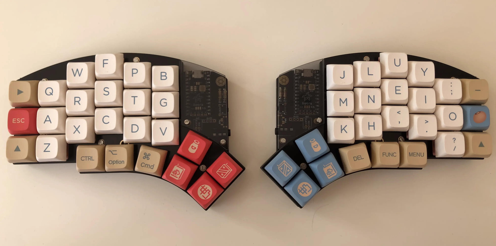
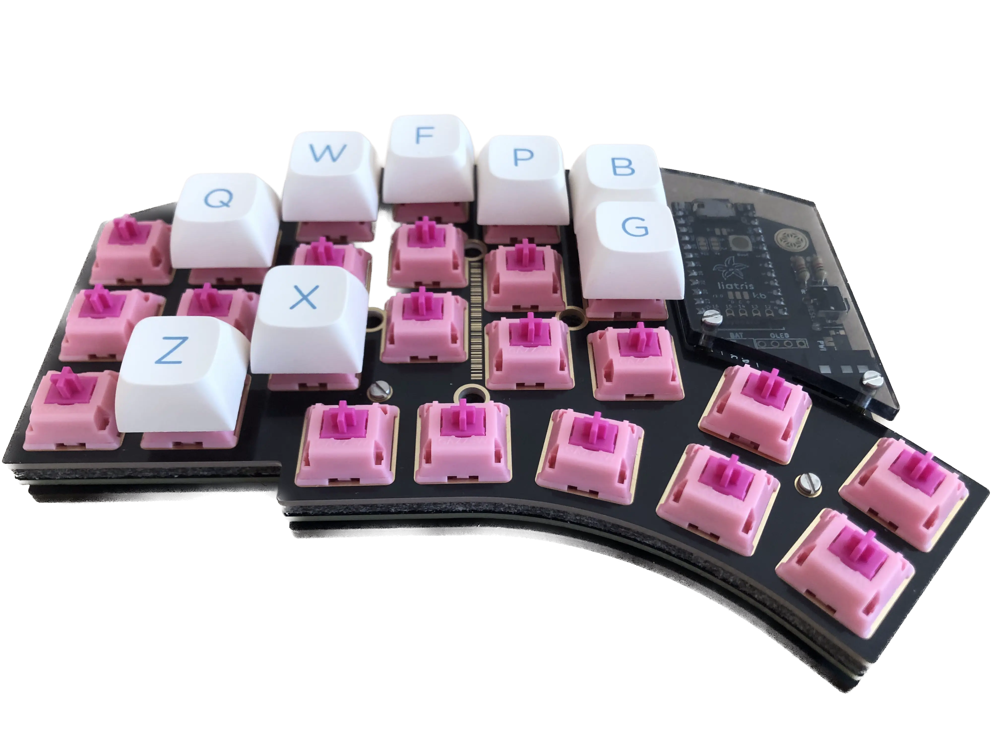
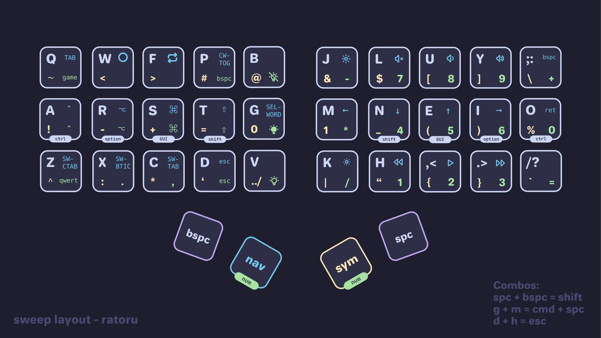

I hated mechanical keyboards until I discovered ergonomic keyboards.

My future was filled with countless hours of typing on poorly designed, regular keyboards. The light at the end of the tunnel: wristpain.
Ergonomic keyboards, on the other hand, are designed to prevent pain.
Unfortunately, the ergonomic keyboard rabbit hole is a daunting world for newcomers.

This guide will walk you through everything you need to know about ergonomic keyboards.

## The basic idea

The goal of ergonomic keyboards is to make typing strainless and prevent repetitive strain injury (RSI).

Here is a list of the most impactful changes you can make to improve the ergonomics of your typing. They are roughly in order of importance.

1. Split the keyboard for better [shoulder and wrist posture](https://www.youtube.com/watch?v=1C2bJkzIaPE&t=3s).
2. Tilt the each half of the keyboard to avoid pinching the nerve in your lower arm.
3. Introduce staggered key columns so that fingers move as their natural motion dictates.
4. Add thumb-key clusters to involve your thumbs in the action.
5. Optionally: Reprogram your keys to create a custom keyboard layout and special keys.
6. Optionally: Reduce the number of keys, so that you barely move your fingers while typing.

If these points sound appealing to you, you are in the right place.

## Ergonomic Keyboards

Ergonomic keyboards usually are split, programmable keyboards with staggered key columns.

To begin you will need to get an overview of [keyboard terminology](https://blog.keeb.io/first-timers/). Take a moment to read through the list. It will make the rest of this article a lot clearer.

The regular mechanical keyboard community places a lot of emphasis on sound, look, and feel. This is less important to me. You can always upgrade your keyboard with the latest and greatest. Comfort is dictated by the physical layout of the keyboard. Changing this layout will require an expensive new purchase, though. To avoid spending money on a keyboard that does not fit your hands, you can use [this website](https://jhelvy.shinyapps.io/splitkbcompare/) to print out the layout of each keyboard. I highly recommend putting your fingers on the paper to figure out whether pressing the keys is comfortable. Take special care to analyze the thumb cluster. Personally, I really dislike the tucked in thumb clusters of keyboards like the `Corne`.

One of the first decisions you will have to make is wether to buy pre-soldered or DIY. Let's take a look at the options.

### Pre-soldered Keyboards

Buying a pre-soldered keyboard can save you a lot of time and soldering mistakes. Of course, you will have to pay for the service in return.

A popular pre-built keyboard is the [Moonlander](https://www.zsa.io/moonlander/). If you buy a keyboard like this, you will also not have to compile your own firmware.

Nowadays, a lot of vendors also offer soldering services for the DIY keyboards. I think this is an appealing option that you should consider! These keyboards tend to still be cheaper than the `Moonlander`, but you save yourself a lot of time and a fixed costs investment into soldering equipment.

### DIY Keyboards

There are many open source, DIY keyboard designs. [Awesome Split Keyboards](https://github.com/diimdeep/awesome-split-keyboards) on GitHub has a comprehensive list of keyboards and collection of useful links.

Once you have picked the keyboard you want to build, you will need a range of [components](https://docs.splitkb.com/hc/en-us/articles/6269948925084-Aurora-Build-Guide-2a-What-s-what-) and soldering equipment. I would expect the total cost to land somewhere between $150 and $300 dollars. Some of the biggest price factors will be:

- Do you own soldering equipment? The equipment might cost you around $60 dollars. At that point, you should at least consider pre-soldered keyboards.
- Do you want "designer" key caps? These can cost between $50-$100.

I went for a relatively basic setup and payed $200. This is much cheaper than prebuilt ergonomic keyboards like the `Moonlander`.

Soldering took a novice like me roughly 10 hours! If soldering is not fun for you, it's another reason to consider buying pre-soldered.

### Things to be aware of

- Use sockets that let you replace your switches.
- Socket your microcontroller. These can easily break and you don't want to have to replace the PCB board.
- Buy a microcontroller with a lot of storage. You don't want to run out of firmware space. The `RP2040` derivatives are a great option.
- How aggressive is the pinky column stacked? Depending on your hand some of the layouts might be uncomfortable for the pinky finger.
- Are the thumb keys comfortable to reach?
- There is a learning curve learning this new keyboard layout.

### Keyboards that stand out to me

:::note
Splitkb has come out with the Halycon series, which did not exist when I built my keyboard. That would be my updated purchase recommendation.
:::

The keyboard in the picture is the [Kyria](https://github.com/splitkb/kyria). It's sold on [splitkb.com](https://splitkb.com/products/kyria-rev3-pcb-kit?variant=43642869580035). The Kyria has a very aggressive pinky stagger and a wide thumb cluster, which I like. Additionally, `splitkb` has a buy guide that walks you through all the components you have to buy, which helps a novice builder a lot.

Other popular keyboards are the ...

- [Iris](https://keeb.io/products/iris-keyboard-split-ergonomic-keyboard)
- [Corne](https://github.com/foostan/crkbd/tree/main)
- [Lily58](https://github.com/kata0510/Lily58)

## Switches

You can usually buy either **MX switches** or **CHOC switches**.

MX switches are the big keys you see on normal mechanical keyboards. There are many colorful caps to customize your keyboard with.

CHOC switches are very low profile, thin switches similar to laptop keyboards. There are not that many options for personalizing the caps.

Beware of the sound when buying. A lot of people in the community enjoy having loud switches, but I want mine to be no louder than the MacBook's keys. Otherwise, your typing will be audible over phone calls, your roommates will be annoyed, and you can't use your keyboard at work. The [Durock Dolphins](https://keeb.io/products/durock-dolphin-silent-linear-switches) seem like a good MX-compatible option. I bought the [Gazzew Bobagum Silent Linear Switch](https://splitkb.com/products/gazzew-bobagum-silent-linear-switch?_pos=8&_sid=4908b0746&_ss=r), which works great so far.

### Switch Types

| Type    | Feeling            | Noise    |
| ------- | ------------------ | -------- |
| Linear  | Smooth, Consistent | Quiet    |
| Tactile | Bumpy              | Moderate |
| Clicky  | Bumpy              | Loud     |

### Rotary Encoders

Some of the custom keyboards support rotary encoders. They are small knobs that you can turn or press to scroll, regulate volume, etc.. Read [this guide](https://docs.splitkb.com/hc/en-us/articles/360010513760-How-can-I-use-a-rotary-encoder-) to see what they are useful for and whether you would like to buy one.

## Keycaps

Keycaps allow for a lot of customization. They come with different profiles, colors, and manufacturing quality. Obviously, you want to buy keycaps that fit your switch type. Here is a good video explaining all the [different MX profiles](https://www.youtube.com/watch?v=14bQeqhlTNM) you can buy.

In general, blank keycaps are easy to find. Keycaps with letters and the special symbols are harder to find. If you find a good vendor, you can also get a cool color scheme. [Drop.com](https://drop.com/home) has beautiful, but expensive, keycaps. For CHOC switches I can recommend 3D-printing [clp keycaps](https://github.com/vvhg1/clp-keycaps). These are slightly scultped and feel quite nice to me. You can also get some cheap ones for either switch type off of Amazon.

Since custom keycaps are a niche market, people sometimes organize group orders to make them affordable. These can take a year to ship, so pay attention to what you buy. There can be very long wait times.

### Material

- **ABS**: Great for backlit keyboards. Very customizable because they are easy to produce. More shock resistant. Will develop a shine after long use. I think this is what the Macbook keyboard uses. (Might be more silent?)
- **PBT:** More involved production. Your fingers rest on the plastic instead of the paint, so they won't develop a shine. Harder to find customizations for. Doesn't look as good with RBG backlit boards.

**Double shot** key caps are made using two separate pieces of plastic which get moulded together. This makes the keys and imprint last longer.

### Profiles (= shapes)

:::note
Nothing beats testing switches and profiles in a store.
:::

I think it's best to look at a chart of profiles online. Note that uniform profiles make it easier to assemble a custom layout because you don't have to worry about which direction the keycaps shape when putting it onto your board. CHOC keycaps are all uniform, so you won't have any trouble there.

I enjoy using the MT3 and DSA profile. If you do buy MT3 keycaps, make sure to buy the ortho variant.

## Assembly

Follow the assembly guide of your keyboard. They are usually very good. I had very little previous soldering experience and managed. Assembly will take time, though. I highly recommend asking questions in the corresponding community. I asked questions in the `splitkb` Discord server and received a lot of help.

## Accessories

If you are new to mechanical keyboards, you will notice that you cannot rest your wrist on your laptop anymore. Therefore, you might want to get comfortable floating your wrists. Otherwise, you should look into wrist rests.

Do you want to completely max out the ergonomics stat of your keyboard? Then, you should consider tenting your keyboard. Depending on the board you built you have different options. Your board's case might have come with tenting functionality, e.g. using a tri-pod or screws. Otherwise, search GitHub and [Thingiverse](https://www.thingiverse.com/) for tentable cases to 3D print.

## Keyboard Layouts

If you lost some keys during this article, you will need a new layout! Be warned, though. A custom keyboard layout is another rabbit hole. While you wait for your order to deliver, I recommend you get started on designing one. Afterwards, all that's left to do is flash your firmware. Here you can see the keymap for my Aurora Sweep:

I'll show you how to make your own in my [3-part guide on custom keyboard layouts](https://ratoru.com/blog/choose-the-right-base-layout).
